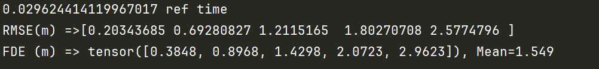

This repository contains the implementation of  **SSTT**.  Pre-trained models are provided in  `./trained_models`. You can run `python evaluate.py` to reproduce the results of our experiments on Ubuntu 18.04. We will open all source code soon. The val and test datasets are available at https://pan.baidu.com/s/1eKWLMyWwsbJ9sRmVC1uY1g. 
extracted code:jydr

## :trophy:Results

Based on our pre-trained model you get the prediction results in our paper.

## Acknowledgements

We sincerely appreciate [CS-LSTM](https://github.com/nachiket92/conv-social-pooling ), [STDAN](https://github.com/xbchen82/stdan), and [HLTP](https://github.com/Petrichor625/HLTP) for their awesome codebases.

