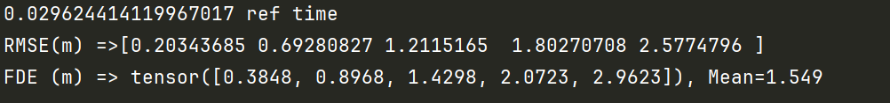

# SSTT: Spatial-Temporal Transformer for Trajectory Prediction

This repository contains the official implementation of **SSTT** - a spatial-temporal transformer model for vehicle trajectory prediction.

[](https://awesome.re)

## :newspaper: Overview

SSTT is a deep learning model designed for predicting vehicle trajectories in complex traffic scenarios. The model leverages spatial-temporal attention mechanisms to capture both the spatial interactions among neighboring vehicles and temporal dependencies in trajectory sequences.

## :rocket: Getting Started

### Prerequisites

- Python 3.11+
- PyTorch 2.0+
- CUDA-capable GPU (recommended)
- Ubuntu 18.04 or later

### Installation

1. Clone the repository:
```bash
git clone https://github.com/lxhy9799/SSTT.git
cd SSTT
```

2. Install dependencies:
```bash
pip install -r requirements.txt
```

3. Download the dataset:
   - Access the validation and test datasets from [Baidu Netdisk](https://pan.baidu.com/s/1eKWLMyWwsbJ9sRmVC1uY1g)
   - Extraction code: `jydr`
   - Place the downloaded files in the `data/ngsim/` directory

### Project Structure

```
SSTT/
├── data/
│   └── ngsim/
│       └── TestSet.mat          # Test dataset
├── trained_models/
│   └── SSTT_ngsim.pth          # Pre-trained model
├── evaluate.py                  # Evaluation script
├── loader.py                    # Data loader
├── model.py                     # Model architecture
├── requirements.txt             # Dependencies
└── README.md
```

## :computer: Usage

### Evaluation

Run the evaluation script with the pre-trained model:

```bash
python evaluate.py
```

### Custom Configuration

You can customize the evaluation parameters:

```bash
python evaluate.py \
    --batch_size 128 \
    --num_workers 4 \
    --test_set data/ngsim/TestSet.mat
```

## :trophy: Results

Based on our pre-trained model, you can reproduce the prediction results presented in our paper:



### Performance Metrics

The model is evaluated using:
- **RMSE (Root Mean Square Error)**: Measured in meters, converted from feet using the factor 0.3048
- **FDE (Final Displacement Error)**: Error at the final prediction timestep
- **Horizontal Evaluation**: Performance across different prediction horizons

## :construction: Development

> **Note**: Full source code will be released soon. The current version includes pre-trained models and evaluation scripts.

## :handshake: Acknowledgements

We sincerely appreciate the following open-source projects for their excellent codebases:

- [CS-LSTM](https://github.com/nachiket92/conv-social-pooling): Convolutional Social Pooling
- [STDAN](https://github.com/xbchen82/stdan): Spatial-Temporal Attention Network
- [HLTP](https://github.com/Petrichor625/HLTP): Teacher-student Trajectory Prediction

## :page_facing_up: Citation

If you find this work useful in your research, please consider citing:

```bibtex
@article{li2025interaction,
  title={Interaction-Aware Trajectory Prediction Method Based on Sparse Spatial-Temporal Transformer for Internet of Vehicles},
  author={Li, Xunhao and Zhang, Jian and Chen, Jun and Qian, Pinzheng},
  journal={IEEE Transactions on Intelligent Transportation Systems},
  year={2025},
  publisher={IEEE}
}
```
